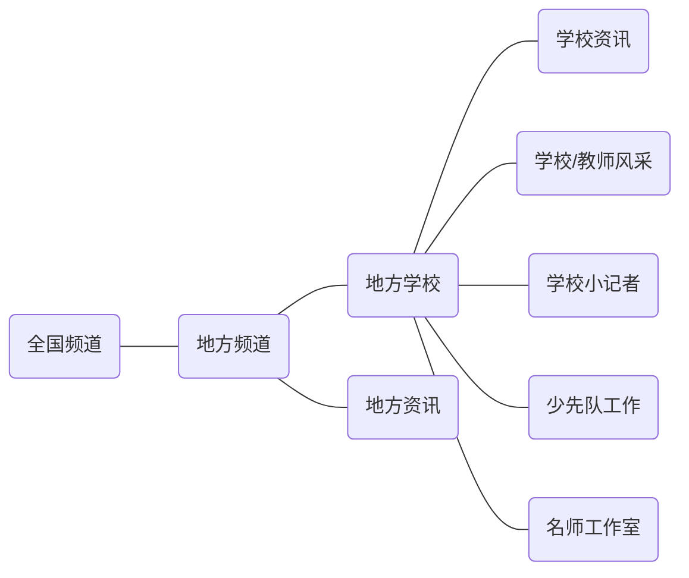

# 产品层级及结构

```mermaid
graph LR
a(全国频道)---a2(地方频道)
a2---b1(地方学校)
a2---b2(地方资讯)
b1---c1(学校资讯)
b1---c4(学校/教师风采)
b1---c2(学校小记者)
b1---c5(少先队工作)
b1---c3(名师工作室)
```
新少年产品的几个重要组成部分包括：
- 学校
- 地方站
- 新少年平台

下面分别从这几个部分的内容进行具体的介绍