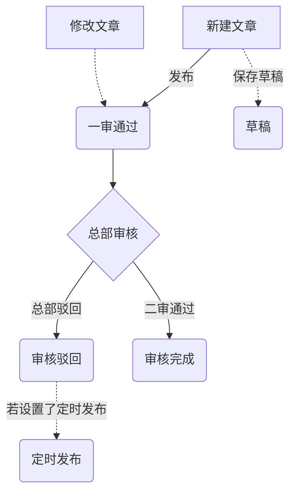

# 内容发布

负责发布、报道与新少年平台的相关的内容资讯。可以通过「内容推荐—添加文章」以及「内容推荐—添加微文章」等两种方式来进行内容的发布操作，其中：

1. 普通文章：普通文章遵循网站栏目设定的概念，是传统的新闻媒体内容形式，支持 图文、视频、音频等多种形式（可参考微信公众号文章）
2. 微文章：微文章形式及内容组成较普通文章更轻量级一些，是一种更便捷的内容发布形式（可参考微博、朋友圈）

平台运营工作人员可将内容推荐至包括全国&地方频道在内的任意站点。

##### 普通文章发布规则说明

- 文章标题不允许超过100个汉字
- 文章标题、所属栏目、文章内容以及封面图为必填项，文章栏目默认为系统设定的栏目
- 编辑为必填项，需要填写稿件的编辑人员信息
- 发布普通内容的时候可以设置一个相关话题，该话题可以是系统已有的，也可以是新的话题
- 在设置定时发布时，最大发布时间不允许超过7个自然日
- 封面图尺寸建议使用300x200px，系统会提供图片[裁剪工具](https://github.com/fengyuanchen/jquery-cropper)

##### 发布文章流程说明

平台运营人员（地方频道及总部）发布的内容也需要经过内容审核，与学校不同的是，平台运营人员发布的内容默认是一审通过，只需要经过总部二审通过即可完成发布操作，相应的文章状态变更流程如下：

##### 微文章内容发布说明

- 微文章内容为必填项，内容可以是由文字、文字&图片、文字&视频的形式，其中文字内容长度不限，图片不允许超过9张，视频数量不允许超过1个等
- 微文章同样可以关联至某个话题，该话题可以是系统已有的，也可以是新的话题