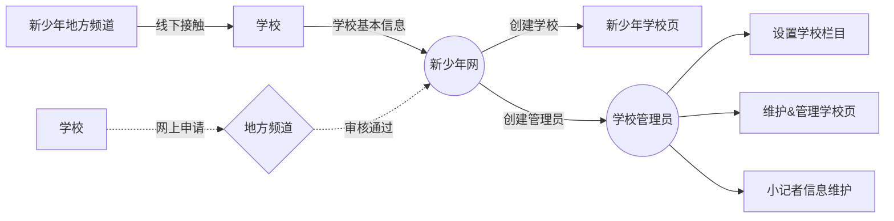

# 学校创建

学校创建目前有两种途径：

- 第一种是线下的方式：由新少年各个地方频道的负责人与学校对接人员线下沟通，通过一些基本信息进行学校的开通，开通后系统会自动生成一个学校管理员账号，通过该账号，学校负责人可以登录系统后台进行学校内容的完善，并负责学校内容的更新及维护
- 第二种则是通过线上申请的方式，学校负责人将一些必要的资料提交上来，地方频道负责人可以在后台进行审核，审核通过后学校即创建成功，同样会生成学校管理员账号，由学校管理员进行学校内容的更新及维护

##### 学校后台录入

1. 地方负责人可通过 「学校管理—新建」 来添加学校，并在添加完成后
2. 添加完成后系统会自动生成管理员账号
3. 学校管理员登录学校后台进行相关管理工作

##### 用户前台申请

1. 学校用户可以在前台进行学校[开通申请]()，并填写开通所需要的相关资料信息
2. 地方负责人员可在审核后台针对已经提交的学校开通信息进行审核，审核通过的申请系统会自动创建学校管理员账号
3. 学校管理员登录学校后台进行相关管理工作