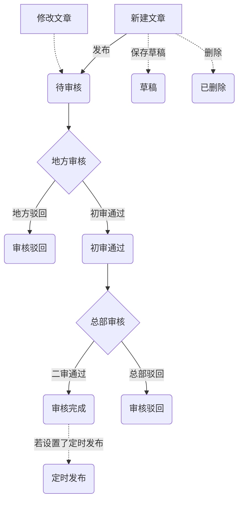

# 内容发布

管理员可以通过「内容管理—添加文章」以及「内容管理—添加微文章」等两种方式来进行学校资讯、活动公告等内容的发布操作，其中：

1. 普通文章：普通文章遵循网站栏目设定的概念，是传统的新闻媒体内容形式，支持 图文、视频、音频等多种形式（可参考微信公众号文章）
2. 微文章：微文章形式及内容组成较普通文章更轻量级一些，是一种更便捷的内容发布形式（可参考微博、朋友圈）

##### 普通文章发布规则说明

- 文章标题不允许超过100个汉字
- 文章来源为必填项，其中：
  - 当文章来源为学校小记者时，小记者为必填项；
  - 当文章来源为本校师生时，需填写作者姓名；
  - 当文章来源为转载时，需填写作者姓名以及转载地址
- 文章标题、所属栏目、文章内容以及封面图为必填项，其中：
  - 文章栏目默认为系统设定的栏目，学校管理员可以在栏目管理模块中根据学校的实际情况来选择是否需要开启栏目
  - 在新建内容时被设置为隐藏的栏目不会出现在栏目的下拉列表中
- 学校在发布普通内容的时候可以设置一个相关话题，该话题可以是系统已有的，也可以是学校自己创建的话题
- 在设置定时发布时，最大发布时间不允许超过7个自然日
- 封面图尺寸建议使用300x200px，系统会提供图片[裁剪工具](https://github.com/fengyuanchen/jquery-cropper)

##### 微文章内容发布说明

- 微文章内容为必填项，内容可以是由文字、文字&图片、文字&视频的形式，其中文字内容长度不限，图片不允许超过9张，视频数量不允许超过1个等
- 微文章同样可以关联至某个话题，该话题可以是系统已有的，也可以是学校自己创建的话题

##### 文章审核流程

**审核机制：地方及总部两道审核把控**

初期，新少年产品中所有的内容都会经过地方及总部两道审核，只有两道审核都通过的内容才会予以前台展示及发布，发布内容的审核状态变化如下：

1. 学校管理员新建或对文章设置了定时发布，文章状态为 待审核
2. 针对待审核的文章，如果点击了保存按钮，文章状态则变更为 草稿状态；草稿状态的文章可以再次编辑、修改，提交后变更为 待审核状态
3. 待审核的文章平台会进行内容审核，不允许内容中出现涉黄、涉爆、涉政以及不利于青少年健康成长的违规内容，审核通过后的文章状态变更为 审核完成
4. 若文章中包含违规内容，平台审核不通过，文章状态会变更为 「审核驳回」
5. 审核通过的文章，若果设置了定时发布，则文章状态会显示为 定时发布

> 审核中/审核完成/审核驳回/定时发布状态下的文章如果修改后重新提交，则会重新进入审核流程

参考：[网络视听节目内容审核通则](https://baike.baidu.com/item/%E7%BD%91%E7%BB%9C%E8%A7%86%E5%90%AC%E8%8A%82%E7%9B%AE%E5%86%85%E5%AE%B9%E5%AE%A1%E6%A0%B8%E9%80%9A%E5%88%99)